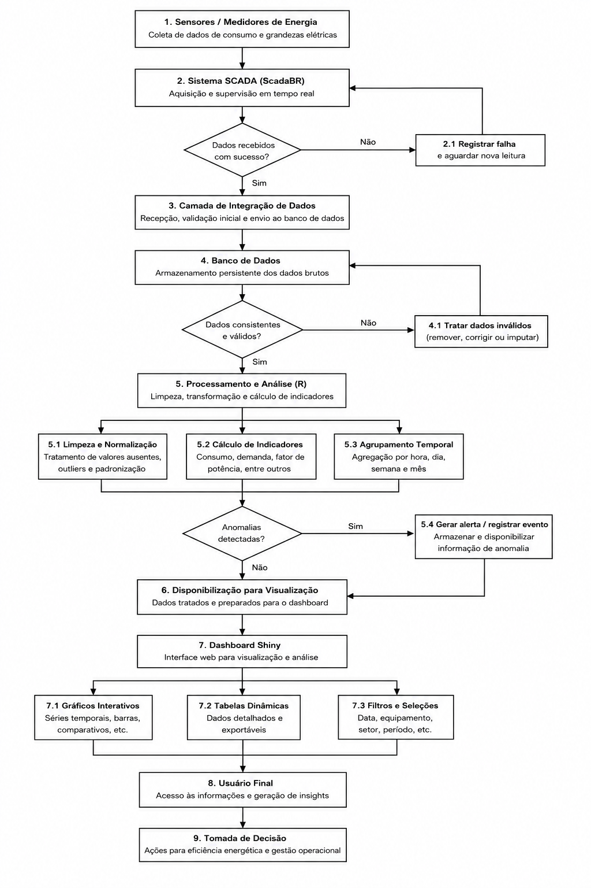

# Visão Geral do Sistema

## 1. Contexto do Sistema

O ScadaBR-CTI é uma solução de monitoramento e análise de dados operacionais baseada em dados provenientes do sistema supervisório ScadaBR. O sistema foi desenvolvido para suportar análise histórica de variáveis operacionais, com foco em eficiência energética, desempenho de infraestrutura e suporte à tomada de decisão técnica.

### 1.1 Hierarquia de Distribuição e Monitoramento

Para entender como os dados são coletados, é fundamental visualizar a topologia elétrica do CTI Renato Archer. O diagrama abaixo representa o fluxo de energia, desde a entrada pelo Sistema Interligado Nacional e concessionária (CPFL), passando pelos transformadores e geradores, até chegar às cargas críticas.

Este mapeamento é o que permite ao ScadaBR-CTI:

* Rastrear perdas: Identificar em qual estágio da distribuição ocorre maior consumo ou desperdício.

* Setorizar o consumo: Separar o que é gasto com infraestrutura básica (iluminação/tomadas) do que é consumo de processos críticos (Chillers, Nobreaks, Salas Limpas e Impressoras 3D).

* Gerir Contingências: Monitorar a entrada dos geradores e a saúde dos sistemas de backup em tempo real.

  

## 2. Objetivo Técnico

O sistema tem como objetivo principal a transformação de dados operacionais brutos em indicadores estruturados, permitindo:

* Monitoramento temporal de variáveis energéticas e operacionais
* Análise de séries temporais de consumo e carga
* Avaliação de desempenho de equipamentos e sistemas
* Identificação de padrões sazonais e comportamentais
* Suporte à detecção de anomalias operacionais
* Geração de indicadores para eficiência energética

## 3. Arquitetura do Sistema

A arquitetura é composta por três camadas funcionais:

### 3.1 Camada de Aquisição de Dados

Dados são coletados via sistema ScadaBR, responsável pela leitura de sensores e dispositivos em campo, operando como interface entre o ambiente físico e o sistema de informação.

### 3.2 Camada de Armazenamento

Os dados são armazenados em banco de dados, estruturados em séries temporais e tabelas normalizadas, permitindo consultas históricas e agregações por diferentes granularidades temporais.

### 3.3 Camada de Processamento e Visualização

O processamento é realizado em R, com pipeline de transformação, limpeza e agregação dos dados. A visualização é implementada via Shiny, com suporte a gráficos dinâmicos e consultas interativas.

## 4. Fluxo de Dados

O pipeline de dados segue a seguinte sequência:

* Aquisição de sinais via ScadaBR
* Registro dos dados em banco relacional
* Extração via queries SQL em R
* Pré-processamento (limpeza, normalização e tratamento de missing data)
* Agregação temporal e construção de métricas
* Geração de indicadores operacionais
* Visualização via dashboard interativo

  

  
  

## 5. Modelagem Analítica

O sistema opera principalmente sobre séries temporais estruturadas, permitindo:

* Agregações por minuto, hora, dia e semana
* Comparações interperíodo (baseline vs atual)
* Análise de tendência e sazonalidade
* Segmentação por pontos de medição
* Correlação entre variáveis operacionais

## 6. Indicadores Derivados

Os principais indicadores gerados incluem:

* Consumo energético agregado e segmentado
* Perfil de carga por período operacional
* Variabilidade de consumo (desvio e dispersão)
* Eficiência relativa entre unidades monitoradas
  
## 7. Tecnológias Empregadas

* ScadaBR (aquisição e supervisão industrial)
* MySQL / banco de dados (armazenamento de dados)
* R (manipulação de dados e análise estatística)

  ### 7.1 Bibliotecas
  
shiny: É o motor principal; permite criar aplicativos web interativos usando apenas a linguagem R.

shinythemes: Fornece "temas" visuais prontos para mudar as cores e fontes do dashboard com um clique.

Conexão e Banco de Dados
DBI: Funciona como uma interface padrão para comunicação entre o R e diversos sistemas de bancos de dados.

RMySQL: É o driver específico que permite ao R "falar" com o banco de dados MySQL/MariaDB do seu projeto.

Manipulação e Limpeza de Dados
dplyr: Ferramenta essencial para manipular dados (filtrar linhas, selecionar colunas, agrupar e realizar cálculos).

tidyr: Serve para organizar dados "bagunçados", permitindo remodelar tabelas (ex: transformar colunas em linhas).

Gestão de Tempo e Datas
lubridate: Facilita a leitura e operações matemáticas com datas (ex: somar dias ou extrair o mês de um timestamp).

hms: Biblioteca especializada em tratar variáveis que contêm apenas Horas, Minutos e Segundos.

Gráficos e Visualização
ggplot2: A ferramenta mais poderosa para criar gráficos estáticos e customizados (barras, linhas, dispersão).

plotly: Transforma os gráficos do ggplot2 em versões interativas (com zoom e leitura de valores ao passar o mouse).

Tabelas Interativas
DT: Permite exibir tabelas no dashboard com recursos de busca, paginação e ordenação automática.

## 8. Integração com o Repositório

Este repositório centraliza:

* Scripts de extração e tratamento de dados
* Modelos de análise em R
* Dashboards interativos
* Documentação técnica do pipeline
* Estrutura do banco de dados e consultas
